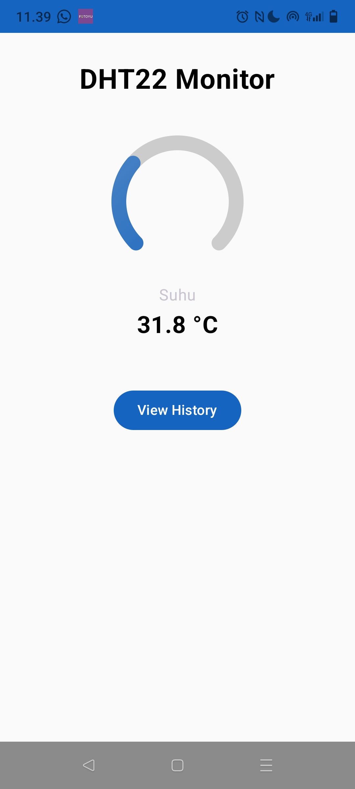

# 🌡️ Smart Environment Monitor (ESP32 + Laravel + Android Compose) 🌿


<!-- Ganti dengan path ke gambar/GIF utama Anda -->

A comprehensive Internet of Things (IoT) solution for real-time environment monitoring (temperature & humidity) and automated device control. This project integrates an ESP32 microcontroller with various sensors and relays, a Laravel backend for data management, and a modern Android application built with Jetpack Compose for remote visualization and interaction.

---

## ✨ **Features**

*   **Advanced Sensor Reading:**
    *   Precise temperature measurement using **K-Type Thermocouple via MAX6675 module**.
    *   Accurate humidity measurement from **DHT22 sensor**.
*   **Automated Environmental Control:**
    *   Intelligent control of external devices (Lamp, Fan, Humidifier) via **relays** based on configurable temperature thresholds.
*   **Local Real-time Display:**
    *   Live display of temperature, humidity, and relay statuses on a **16x2 LCD I2C**.
*   **Robust Data Backend:**
    *   **Laravel (PHP & MySQL)** based RESTful API to receive sensor data from ESP32 and serve historical data to the Android application.
*   **Modern Android Application (Jetpack Compose):**
    *   **Intuitive UI:** A beautifully designed mobile application with a cool and calm color palette.
    *   **Real-time Monitoring:** Custom **gauge indicators** for live temperature and humidity readings, along with numerical values.
    *   **Historical Data:** Auto-refreshing list of past sensor readings.
    *   **Splash Screen:** Custom splash screen with project attribution.
    *   **Seamless Navigation:** Smooth transitions between monitoring and history screens using Jetpack Compose Navigation.
    *   **Network Resilience:** Robust API communication using Retrofit & Coroutines with proper error handling and locale-independent numeric parsing.

---

## 🛠️ **Technologies Used**

### **Hardware**
*   **ESP32 Dev Module**
*   **MAX6675 Module + K-Type Thermocouple**
*   **DHT22 Temperature & Humidity Sensor**
*   **16x2 LCD I2C Display**
*   **Relay Module (e.g., 4-channel)**
*   WiFi Module (integrated in ESP32)

### **Firmware (ESP32)**
*   **Arduino IDE (C++)**
*   **Libraries:** `DHT22`, `WiFi`, `HTTPClient`, `Wire`, `LiquidCrystal_I2C`, `MAX6675`

### **Backend**
*   **Laravel (PHP)**
*   **MySQL Database**

### **Mobile Application (Android)**
*   **Kotlin**
*   **Jetpack Compose**
*   **Retrofit** (for API communication)
*   **Kotlin Coroutines** (for asynchronous operations)
*   **Navigation Compose**
*   **Android Jetpack Lifecycle Components** (ViewModel, LiveData)
*   **Material Design 3**

---

## 🚀 **Getting Started**

To set up and run this project, follow these steps:

### **1. Backend Setup (Laravel)**

1.  **Clone the repository:**
    ```bash
    git clone https://github.com/yourusername/dht-monitor-backend.git
    cd DhtAppBackend
    ```
    *(Note: Assuming you'll have a separate repo for backend or a monorepo setup)*
2.  **Install Composer dependencies:**
    ```bash
    composer install
    ```
3.  **Copy `.env` file:**
    ```bash
    cp .env.example .env
    ```
4.  **Generate application key:**
    ```bash
    php artisan key:generate
    ```
5.  **Configure Database:**
    *   Edit your `.env` file with your MySQL database credentials (e.g., `DB_DATABASE=dht_monitor_db`, `DB_USERNAME=root`, `DB_PASSWORD=`).
    *   Create the database (`dht_monitor_db`) in your MySQL server.
6.  **Run Migrations:**
    ```bash
    php artisan migrate
    ```
    *(Remember to add `temperature` and `humidity` to `$fillable` property in `app/Models/DhtData.php`)*
7.  **Start Laravel server:**
    ```bash
    php artisan serve
    ```
    *(Note the IP address and port, e.g., `http://192.168.1.100:8000`)*

### **2. ESP32 Firmware Setup**

1.  **Open Arduino IDE:**
    *   Ensure you have the ESP32 boards manager installed.
    *   Install required libraries via Sketch > Include Library > Manage Libraries:
        *   `DHT22` (by Adafruit)
        *   `MAX6675 library` (by Adafruit)
        *   `LiquidCrystal I2C` (e.g., by Frank de Brabander or Marco Schwartz)
        *   `HTTPClient`, `Wire`, `WiFi` (usually built-in)
2.  **Open the ESP32 project:** Navigate to your `.ino` file in Arduino IDE.
3.  **Configure Credentials & IP:**
    *   Replace `"YOUR_WIFI_SSID"` and `"YOUR_WIFI_PASSWORD"` with your actual WiFi credentials.
    *   Replace `"http://YOUR_LARAVEL_IP_ADDRESS:8000/api/dht/store"` in `serverUrl` with the actual IP address of your Laravel backend server (e.g., `http://192.168.1.100:8000/api/dht/store`). **Do NOT use `127.0.0.1` here.**
4.  **Verify Pin Assignments:**
    *   Double-check the pin assignments in your ESP32 code (`DHT_PIN`, `thermoCLK`, `thermoCS`, `thermoDO`, `RLampu`, `RKipas`, `RHumi`) against your actual wiring. Ensure no conflicts and they are valid GPIOs.
5.  **Upload to ESP32:**
    *   Select your ESP32 board (e.g., "ESP32 Dev Module") and port.
    *   Upload the code to your ESP32.
    *   Open Serial Monitor (115200 baud) to observe ESP32's connection status and sensor readings.

### **3. Android Application Setup**

1.  **Open Android Studio:**
    *   Open the Android project (`DhtApp`).
2.  **Configure API Base URL:**
    *   Open `app/src/main/java/com/yourcompany/dhtmonitor/api/ApiClient.kt`.
    *   Replace `"http://YOUR_LARAVEL_IP_ADDRESS:8000/api/"` in `BASE_URL` with your Laravel backend's IP address and port.
        *   For **Android Emulator:** Use `http://10.0.2.2:8000/api/`.
        *   For **Physical Android Device:** Use your PC's actual LAN IP (e.g., `http://192.168.1.100:8000/api/`).
3.  **Allow Cleartext Traffic (for local development):**
    *   Open `app/src/main/res/xml/network_security_config.xml`.
    *   Ensure `192.168.38.157` (or your Laravel IP) and `10.0.2.2` are whitelisted under `domain-config cleartextTrafficPermitted="true"`.
4.  **Install & Run:**
    *   Build and run the application on an Android emulator or a physical device.
    *   Observe Logcat for any errors or network activity.

---

## 🔌 **Wiring Diagram (Conceptual)**

*(Consider adding a simple diagram here to visualize connections, e.g., using Fritzing or a hand-drawn sketch scanned in)*

**ESP32 Pin Assignments (Summary):**

*   **DHT22:** Data -> GPIO 27
*   **MAX6675:** CLK -> GPIO 18, CS -> GPIO 5, DO -> GPIO 23
*   **LCD I2C:** SDA -> GPIO 21, SCL -> GPIO 22
*   **Relays:**
    *   Lampu -> GPIO 19
    *   Kipas -> GPIO 14
    *   Humidifier -> GPIO 2

---

## 🤝 **Contribution**

Feel free to fork this repository, open issues, or submit pull requests. Any contributions to improve the project are highly appreciated!

---

## 📜 **License**

This project is licensed under the MIT License - see the [LICENSE](LICENSE) file for details.
*(Make sure to create a LICENSE file in your repository)*

---

## ✉️ **Contact**

Created by [Alfin] - Feel free to connect on [LinkedIn](https://www.linkedin.com/in/novendri-noven-a0896a339) or [GitHub](https://github.com/N-VenZ13).


---